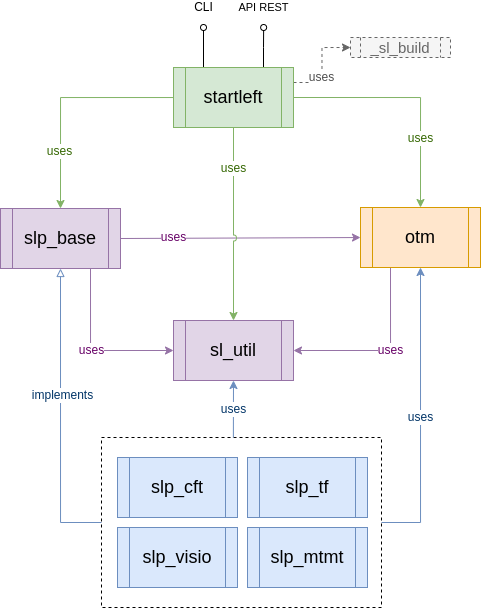
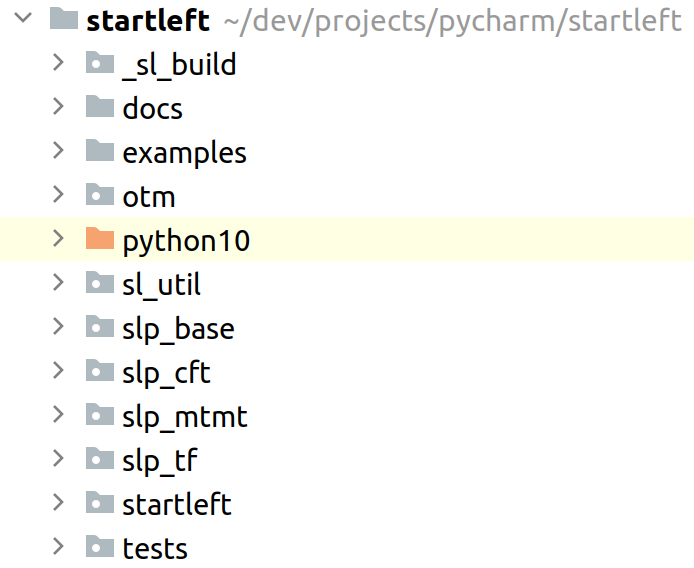
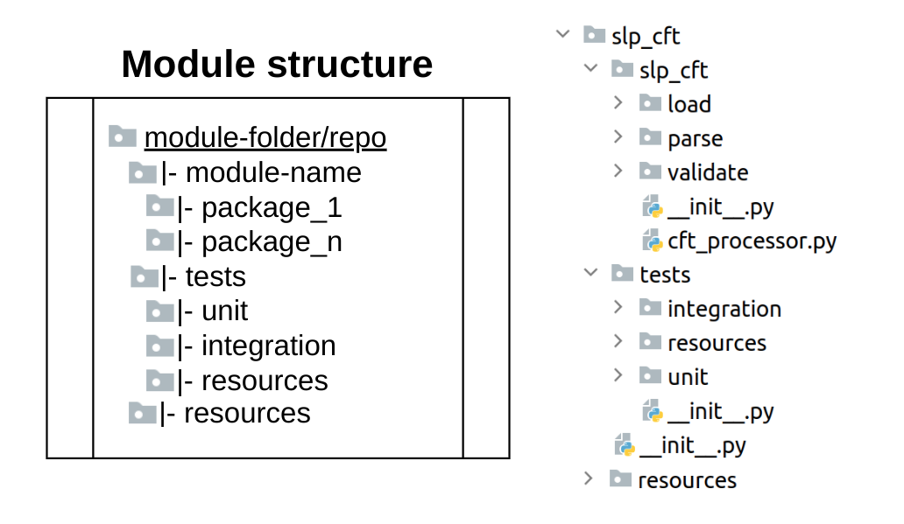

# Architecture

## Context

---
StartLeft is a modularized application that groups a set of processors that are able to convert different formats to 
[OTM](../Open-Threat-Model-(OTM).md). It can be used through a CLI, and it also exposes a REST API. However, the 
point of 
access is indifferent as, under the hood, both make use of the same conversion logic, that is implemented in a special 
type of modules called SLPs (StartLeft Processor), described below in this page.

If we take as a reference the big picture of the usage that IriusRisk makes of StartLeft, it plays the role of a service 
consumed by the IriusRisk core through the REST API. For instance, this is a general view of project importing in IriusRisk:


## Module Based Architecture

---
The internal architecture of the StartLeft application is based on a set of modules with well-defined responsibilities and dependencies.



The diagram above shows the different modules currently implemented in StartLeft. The main considerations about them are:

All the dependencies are fixed and unidirectional and **the project is configured to raise a "compile time" exception in case 
some module tries to do a forbidden import**.

StartLeft does not directly import any specific processor, but relies on the configuration located in `_sl_build` and on 
`slp_base` logic to choose the right implementation for each case. This means that **new processors can be added without modifying 
any preexisting module**.

The OTM does not have the `sl` or `slp` prefixes because it is intended to be released as a general lib for general definitions 
and logic related with the standard that could be imported independently of StartLeft.

### Repository Structure
All the modules are located just under the root folder in the StartLeft's repo and must also fit the following common structure:



Since a general Python standard for modularizing projects does not exist, the chosen one is based 
on the one used by several Open Source projects as well as by the StartLeft project itself before the modularization. It is important 
to notice that, with this structure, each module is being isolated as if it was an independent project. The goal of this is to 
facilitate a future migration to independent repositories.

### Module Structure
> **Note:** `_sl_build` is an internal module with configuration and building purposes that does not fit the structure explained below.



In the root package of each module, there are only two subpackages, and a resources folder. The first subpackage has the 
same name as the module itself and contains the production code. The other one is called `tests` and contains specific 
tests for that module. The resources folder contains the resources needed by each module, for example, the schemas used 
for validating mapping files.

The root folder of each module represents its main boundary and may be understood as the main project folder if the modules 
where migrated to independent repositories. However, instead of being simply folders, they need to be 
[python regular packages](https://docs.python.org/3/reference/import.html#regular-packages) 
with their own `__init.py__` file, which is an important nuance to consider. This file contains, for each module, a call to a 
function defined in the `_sl_build` packages that overrides the native python’s import function with a custom one that avoids 
forbidden imports between modules. In case new modules are added to StartLeft, this call must be added to their main package’s 
`__init.py__` file.
```python
######################################################################
# This folder is not actually intended to be a regular package       #
# HOWEVER, we need to keep this __init.py__ file in order to         #
# make it visible by other modules.                                  #
# In future versions, this package should be moved to a lib so       #
# that it will be an independent module instead of a "false" package #
######################################################################

# DON'T REMOVE: Module importer overwritten to prevent bidirectional dependencies
from _sl_build.secure_importer import override_module_importer
override_module_importer()
```

#### Production Code Package
**The name of this package must match the main package**. This is the place where the actual business logic code of the module is located. 
The structure inside it is completely free, and it depends only on the needs of the logic implemented in the module.

#### Test Code Package
As has been already stated along this document, each module is a completely independent piece of software. Of course, 
this also includes that it must also contain its own test code. Since each module has specific responsibilities, these are 
the only ones that need to be tested from both a unitary and integration perspective. For example, every SLP must 
have unitary tests for the classes implemented there, but also integration tests that verifies that the whole conversion to 
OTM process works for every identified casuistic.

Regarding the structure of the whole test code package, there is no a hard constraint about it, but, for readability reasons, 
it is recommended to follow a common one for every module. The one chosen is split in the following packages:
> **Note**: Please don’t be fanatic with the definition of unitary and integration. There are not always clear boundaries, 
> but common sense is the best way to identify what needs to be mocked or not.

* `unit`. For unitary tests.
* `integration`. For integration tests.
* `resources`. It is also recommended to place here a test_resource_paths.py to have a unique point of access to the actual testing resources.
* `util`. In case some general utilities need to be developed for being used in the tests, this package is the right place for them.**

### Main Tests Package
> **Note:**  It is necessary to evaluate the convenience to have this package, but, at least for now, it is important to keep 
> these tests to guarantee the quality of the code.

At the root level of the StartLeft repository (the same as the other modules) a general tests package is located. Unlike 
the test packages located inside each module, this one is generic to the entire the StartLeft project and contains integration tests 
that involves logic belonging to all the modules. By definition, this package can only contain integration tests. 
So, **when a new processor or a new important behavior is added to StartLeft, we need to create their associated integration 
tests at the project level in this package**.

## Modules Description

---
### startleft
This is the main module whose origin is the initial StartLeft project that used to contain all the processing logic for 
the first conversion formats. As part of the modularization process, it was lightened so that it does no longer implements 
any conversion logic, and it simply exposes the CLI and REST API and makes the connection with the SLPs where the conversion 
itself takes place.

<u>Main responsibilities</u>: Expose a CLI and a REST API to enable the access to the conversion to OTM logic.

<u>Imported by</u>:  Not imported.

<u>Imports</u>: `_sl_build`, `slp_base`, `sl_util`, `otm`. It also imports `slp_cft` and `slp_tf` to support the 
search function, whose future is under evaluation.

### sl_util
This is currently the only module that contains common utilities for the rest of the modules of StartLeft. The `sl` prefix 
means that it is not intended to be a very generic module like the Apache Commons in Java, but a module to place useful 
functions for the StartLeft scope (including some OTM related utilities, for example). However, **it is not a mixed bag to 
place common logic related, for instance, with the SLPs**. Business logic or domain classes should fit one of the other 
modules or, if not, maybe a new one should be created.

<u>Main responsibilities</u>: Offer general (not processor specific) utilities related to StartLeft.

<u>Imported by</u>:  `startleft`, `slp_base`, SLPs, `otm`.

<u>Imports</u>: No imports.

### SLPs
The StartLeft processors are the key modules of StartLeft. They contain the specific logic for converting each format to OTM. 
**Each one is focused on converting from one and only one input format** (CFT, TF, Visio, etc.). 
One important thing to notice is that **the integration tests for these modules are the most important ones in the application** 
since they validate behavior for the main purpose and responsibility of StartLeft as a whole.

#### slp_base
This is a critical module where the whole process of conversion is defined, including all the interfaces for each step of 
the conversion process (from loading files to the OTM validation) as well as definition of the errors that the process may 
potentially arise.

<u>Main responsibilities</u>: 

* Defining the main conversion process using a template pattern in the class `OTMProcessor`.
* Defining a set of interfaces for each step of the process (source and mapping files loading and validating, OTM conversion process and OTM validation) that must be implemented by the specific SLPs.
* Defining all the [possible errors](Errors-Management.md) that may arise through the conversion process.
* Defining a `ProviderResolver` class to dynamically retrieve the right SLP based on the source type (CFT, TF, etc.).

<u>Imported by</u>:  `startleft`, SLPs.

<u>Imports</u>: `sl_util`, `otm`. 

#### Concrete Implementations
Each supported provider (CFT, TF, etc.) must have its own processor in order to perform the OTM conversion. They are completely 
independent modules and imports among them are forbidden. The goal is that they can be work in isolation so their evolution 
is also completely independent. **In case some duplication appears between two processors, the first option is to duplicate 
the code** instead of prematurely creating abstractions. Only after these duplications were consolidated, and we could identify 
a really common casuistic, we may think about creating a common module grouping, for instance, logic related with one provider 
type (IaC, diagram or threat modeling). Anyway, **this common logic should be placed in a new dedicated module and never in 
the `sl_util` module**.

<u>Current implementations</u>: 

* `slp_cft` for Cloudformation (IaC).
* `slp_tf` for Terraform (IaC).
* `slp_visio` for MS Visio (Diagram).
* `slp_mtmt` for MS Threat Modeling Tool (Threat model).


<u>Main responsibilities</u>: Implementing the interfaces defined in `slp_base` in order to actually perform the 
 conversion process from the origin provider formats to OTM.

<u>Imported by</u>: No statically imported by any module. They are dynamically instanced by the `slp_base` based 
on the module configuration placed in `_sl_build`.

<u>Imports</u>: Each processor is an independent module that may import different modules. However, in general:

* Must import: `otm` and `slp_base`.
* May import: `sl_util`.
* Cannot import: `startleft`.

### otm

Currently, we have the only public release specifically focused on the OTM standard 
[here](https://github.com/iriusrisk/OpenThreatModel#components-object), that simply contains a `README.md` file with a 
natural language description of the components of the standard. It would be interesting to extend the resources associated 
with the standard and share them with the community (a JSON schema, some kind of validator, etc.). This module is intended 
to be the seed for that public resources' library. This means that **it has not to be understood as a part of StartLeft itself** 
(notice the absence of the `sl` prefix), but as a more generic library exclusively oriented to general OTM concerns.

<u>Main responsibilities</u>: Defining a set of entities that represent the OTM standard as well as providing a 
standard building to simplify the generation of OTM instances.

<u>Imported by</u>: `startleft`, `slp_base`, SLPs.

<u>Imports</u>: Currently, it imports `sl_util`, but, for the reasons explained above, it should not import any 
StartLeft module. 
Thus, we should be careful about creating new dependencies between these two modules.

### _sl_build
This is a special module whose existence is due to the current structure of the project. Since the multimodule management 
is not being done by any external tool (like Maven/Gradle in Java), it is necessary to develop some ad hoc features in order 
to manage the interaction between modules. 

<u>Main responsibilities</u>:

* Defining the main configuration for the modules in a configuration class.
* Name of the module.
* Type of module (`general` or `processor`).
* Forbidden dependencies.
* Provider type supported by each SLP.

Managing the imports between modules to raise an error when trying to import a forbidden dependency.

> **Note**: The imports for this module are not constrained as in the other ones because this is the module that manages 
> these constraints, so it is important to be careful with the imports that are performed here.

<u>Imported by</u>: `startleft` to read configuration and for all the rest of the modules to override the import 
system.

<u>Imports</u>: No imports allowed.

## Building

---
All the modules inside StartLeft are, at the end of the day, Python modules, so `pip` does not have any problem to install a 
project based on them. For this reason, the installation of the StartLeft project can be simply done by executing this command 
inside the StartLeft repository's root folder:

```shell
pip install .
```

About the entrypoints for the application, it is important to difference between the `startleft` whole project and the `startleft` 
module inside it. This means that, to reference some class or module inside it, it is needed to put the name two times (`startleft.startleft`).
For example, in the `docker-compose` command or the docker `ENTRYPOINT`, the FastAPI webapp entry point must be referenced in this way:

## Testing

---
As stated before in this document, each module is an independent software unit with their own tests set. This means that 
the tests can only be executed module by module. In PyCharm, for example, a run configuration must be created for executing 
the tests in each module:


For executing them from the terminal, `pytest` needs to know what is the module that is under testing:
```shell
pytest slp_base
```
It is also possible to execute tests for several modules at the same time:
```shell
pytest slp_base otm startleft
```
However, from the point of view of CI/CD, it is undesirable to include in the pipelines configuration the name of all 
the modules that are required to be tested because this implies that every modification in the module structure or even 
the addition of a new module will provoke the modification of all the pipelines. For this reason, a `run_tests.py` has been 
created in the root of the StartLeft project. It contains the logic for retrieving all the modules in the application and
calling pytest with all of them generating a unique report. So, the command that the pipelines must include for executing 
the StartLeft’s tests is:
```shell
python run_tests.py
```
From a development point of view, the most common scenario is that only the module under development is needed to be frequently tested. 
However, there is no problem about executing all the tests on demand by creating a run configuration that runs that `run_tests.py` file in 
PyCharm and execute all the tests.