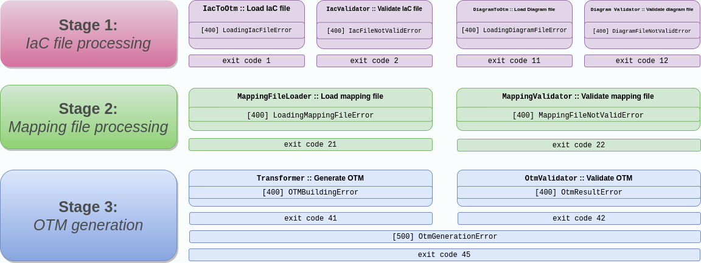

# Errors management

## Steps

---
The management of errors on Startleft  are handled on three separated steps:

1. Reading the source file IaC/diagram
2. Reading the mapping file/s
3. Generating the OTM



## Error types

---
On steps 1 and 2 we can have two error groups:

* **Validation error**: The file is not valid due to wrong mime type, maxsize, etc.
    * `IacNotValidFileError`.
    * `DiagramNotValidFileError`.
    * `MappingFileNotValidError`.

* **Loading error**: We are unable to load the file due to wrong type of type specified or any error inside the file that 
does not permit load its content.
    * `LoadingIacFileError`.
    * `LoadingDiagramFileError`.
    * `LoadingMappingFileError`.

* **OTM generation related errors**:
    * `OtmBuildingError`. We are unable to generate the OTM with the given files.
    * `OtmResultError`. We are able to generate the OTM but the OTM is invalid (e.g: inconsistent IDs).
    * `OtmGenerationError`. There was any unexpected error.

## Http statuses and exit codes

---

| Error code                 | HTTP Status | CLI exit code |
|----------------------------|:-----------:|--------------:|
| `LoadingIacFileError`      |     400     |             1 |
| `IacFileNotValidError`     |     400     |             2 |
| `LoadingDiagramFileError`  |     400     |            11 |
| `DiagramNotValidFileError` |     400     |            12 |
| `LoadingMappingFileError`  |     400     |            21 |
| `MappingFileNotValidError` |     400     |            22 |
| `OtmBuildingError`         |     400     |            41 |
| `OtmResultError`           |     400     |            42 |
| `OtmGenerationError`       |     500     |            45 |


## Http response body

---
The response body on any of this cases will be a json with this structure:
```json
{
    "status": "the numeric http status code",
    "error_type": "<The error type>",
    "title": "<The error on human readable form>",
    "detail": "<The detail of the error>",
    "errors": [
        {
            "errorMessage": "<The reason of the error>"
        }
    ]
}
```

The most important field here is error_type because is the code that the core is going to read to match the error type 
and manage the Startleft error response and send its own response on the core API.