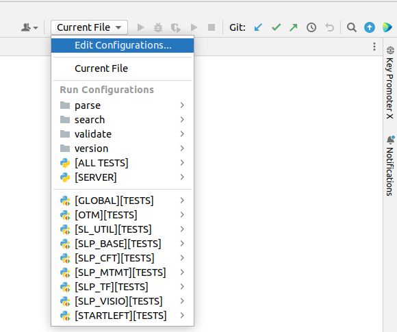

# Run configurations

> **Warning**: This page only applies if you are using PyCharm or IntelliJ as IDE

The easiest way to develop and test StartLeft is by using PyCharm’s Run & debug configurations that references our IaC, 
diagrams and mapping files inside `/examples` project file. 

## How to import?
Since there are a bunch of different commands, modules and 
ways of using and testing StartLeft, you can import the `run_configurations.zip` file placed on the root of the repository. 
For that, manually unzip the file or, in Linux, execute the following command:

```shell
unzip run_configurations.zip
```
Then, a `.run` folder should be created in the root of the project with a bunch of xml files corresponding to each run configuration.
The IDE should automatically process this folder and load all the configurations. Check the upper right corner of the window:



## How to use?
Before going in depth into the different types of configurations and its organization, let's try a couple of basic commands.

Execute `version > [VERSION]` and verify that something like this is shown:

```shell
cli.py, version development-version
```

Now, set up the server with the `[SERVER]` configuration, you should see the starting logs and be able to see the API docs in 
[http://localhost:5000/docs](http://localhost:5000/docs).

Finally, let's try the run configuration for running all the application tests executing the `[ALL TESTS]` run configuration.
Then, the console must show all the tests which are being executed.

## How are they organized?
Once imported all the run configuration will be available organized in the different levels explained below.

### Command launching
The first group of run configurations that appears in the dropdown box is for launching the production code through the different commands supported by StartLeft. It is organized as follows.

#### [SERVER]
This is the most common used run/debug configuration, since it is the one used for launching the StartLeft’s web service that exposes the REST API. It basically launches the StartLeft’s server command.

#### CLI commands
Each CLI supported command has its own folder with several examples to be run with different parameters. The format for the name of these configurations is:

`[COMMAND][PROVIDER][USE CASE NAME]` 

For example, to launch the parse command with the Cloudformation example for security groups, the run configuration is called:

`[PARSE][CFT][SECURITY GROUPS]`

#### [ALL TESTS]
This is a special case of the run configurations. Since StartLeft contains a group of independent modules, the only way 
to launch all the tests for all the modules in a single command is having a python script with the logic to retrieve all these tests. 
This run configuration runs that script in order to execute all the tests for the whole repo.

### Test launching
Tests have their own specific section of run configurations with the following subsections.

#### Module tests
Each [StartLeft module](Architecture.md) has a run configuration to launch its tests. The naming for this run configurations is:

`[MODULE_NAME][TESTS]` 

For instance, if we want to launch the tests for the Cloudformation SLP module, the run configuration is `[SLP_CFT][TESTS]`.

#### [GLOBAL][TESTS]

Apart from the module-specific tests, there is a group of global integration tests for the whole StartLeft that has its own launcher, 
called `[GLOBAL][TESTS]`. Do not confuse this run configuration with `[ALL TESTS]`, that runs all the tests, including the global ones 
as well as the tests for each module.

## Example files

---
The provided run configurations contain only relative paths to files existent inside the StartLeft repository, so you should 
not need to change any parameter in the given run configurations. If so, this would be probably because some file has been renamed 
or deleted from the repository.

