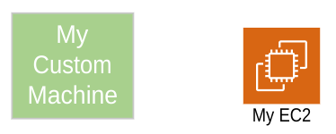
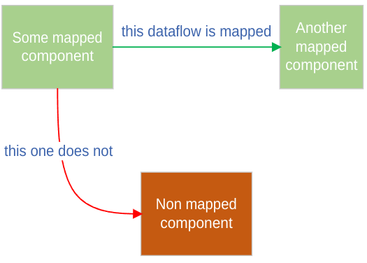

# Visio Mapping
The greatest challenge for mapping Microsoft Visio files is that it is a completely open format where the user can
place whatever they want. For that reason, the `slp_visio` works with some premises in order to build an OTM file
with only the necessary information:

* There are different ways of parsing TrustZones, but no TrustZone will be generated if it does not appear in any
  of the mapping files.
* The only shapes that will be parsed into the OTM components are the ones whose name or type matches some label in the 
  mapping file. The rest of them will be ignored.
* There is no need to create mappings for the DataFlows, they will be generated from those Visio connectors that 
  link components that have been also mapped into the OTM.
* Nested shapes are automatically processed and parsed to the OTM components and TrustZones. There is no need to 
  define parent relationships in the mapping files.

## Mapping hierarchy

---
The StartLeft's Visio SLP support two types of mapping files. They both have exactly the same structure and behavior,
but are intended to be used for different types of mappings. 

### Default mapping file
As stated in the [Visio Quickstart](Visio-Quickstart.md), stencils are a powerful Visio feature. From the point of 
view of StartLeft, those users that use them in their diagrams may reduce a lot the work they have to do in order to 
build their mappings. This is because the mappings for the stencils can be reused across every request to StartLeft 
and does not need to be created each time.

Other potential case or mappings reuse are the generic TrustZones. Even you may have some diagrams with specific 
TrustZones, it is a common case to have a fistful of them that tend to be present in the most of your diagrams. 
Thus, you should not need to map them again and again. In conclusion, for all those elements that you do not want to 
map in each request because are common and reusable, you can build a default mapping file. Indeed, if you are 
going to use StartLeft in a script or pipeline, you can simply save the default mapping file and inject them in 
every StartLeft request. So is, for example, how IriusRisk's import processes work.

### Custom mapping file
This file is used to cover the rest of elements that are not generic, but specific for a concrete diagram. 
Remember that only the shapes whose type or name are in the mapping file will be parsed into the OTM so, everything 
you need to be processed in a Visio file should be in the default or in the custom mapping file. <u>In case the same 
mapping appears in both mapping files, the one in the custom file has preference</u>.


## Mapping file structure

---
The Visio mapping file is expected to be a YAML file whose structure is exactly defined by its
[json schema](https://github.com/iriusrisk/startleft/blob/main/startleft/resources/schemas/diagram_mapping_schema.json). 
It is divided in three great blocks described in deep below. So, the root structure of the file is composed by three 
arrays for the mappings of each type of element:

```yaml
trustzones: []
components: []
dataflows: []
```

Each of these arrays contains the information for mapping shapes into TrustZones, Components or Dataflows, respectively.

### Mapping TrustZones
The [OTM standard](../../Open-Threat-Model-(OTM).md) defines that every component in the threat model must have a 
parent, so you must be sure that the mapping file contains a mapping entry for all the TrustZones present in the 
diagram as well as a default one so, if no parent can be calculated for a component, it can fall into this default 
TrustZone. 
```yaml
trustzones:
  - label:  Public Cloud
    type:   My Public Cloud
    id:     b61d6911-338d-46a8-9f39-8dcd24abfe91
```

When a shape is found in the Visio file whose **name** matches the mapping's **label**, then a TrustZone is created 
in the OTM whose **name** is the mapping's **type** and its **id** is the mapping's **id**. 

For example, for this TrustZone in the Visio file and the previous mapping:


The resultant OTM would contain a TrustZone like this:
```json
{
  "trustZones": [
    {
      "id": "b61d6911-338d-46a8-9f39-8dcd24abfe91",
      "name": "My Public Cloud",
      "risk": {
        "trustRating": 10
      }
    }
  ]
}
```

These are the basics for the TrustZone mapping behavior, but TrustZones may be defined in different and more complex 
ways that are explained in deep in the 
[TrustZones mapping's page](Visio-TrustZones-Mapping.md).

#### Default TrustZone
Sometimes maybe it is not possible to calculate a parent for a component. Since it necessarily must have one, we 
need to define a default TrustZone to be used in these cases. At this point, there is no way to configure what is 
the default TrustZone and <u>the one whose label is _Public Cloud_ will always be selected as the default one</u>. In a 
near future, a new attribute will be added to the TrustZone mappings so this could be configurable.  

### Mapping Components
Components mappings' structure is similar to the TrustZones. For example, we can have a mapping like this:
```yaml
components:
  - label:  Shape's name
    type:   OTM's type
```
However, its behavior presents the particularity that the label may refer to the _type_ or the _name_ of the shape. 
For instance, suppose we have this diagram:



Considering that the *My EC2* shape belongs to the AWS stencils, the more logical scenario is mapping it by **type** 
in the default mapping file. For that, you have to use its name in the stencil, that is the one you can see in Visio 
when you select the shape:


With this, you may compose a mapping like this:
```yaml
components:
  - label:  Amazon EC2
    type:   ec2
```

That will result in an OTM component like this:
```json
{
  // The ID is the unique id got from the Visio file
  "id": "1",
  "name": "My EC2",
  "type": "ec2",
  "parent": {
    // The parent is the default TrustZone
    "component": "b61d6911-338d-46a8-9f39-8dcd24abfe91"
  }
}
```

For the _My Custom Machine_ component, you need to map by name instead of type, so we can create a custom mapping 
file with this content:
```yaml
components:
  - label:  My Custom Machine
    type:   empty-component
```

The OTM result would be:
```json
{
  // The ID is the unique id got from the Visio file
  "id": "2",
  "name": "My Custom Machine",
  "type": "empty-component",
  "parent": {
    // The parent is the default TrustZone
    "component": "b61d6911-338d-46a8-9f39-8dcd24abfe91"
  }
}
```

Finally, it is important to notice that <u>the mapping by name has priority over the mapping by type</u>. So if you 
include in the default mapping file a mapping for the _My EC2_ component by its name like this:
```yaml
// In the default mapping file
components:
  - label:  Amazon EC2
    type:   ec2

// In the custom mapping file
components:
  - label:  My EC2
    type:   empty-component
```

This would result in a OTM like this:
```json
{
  // The ID is the unique id got from the Visio file
  "id": "1",
  "name": "My EC2",
  "type": "empty-component",
  "parent": {
    // The parent is the default TrustZone
    "component": "b61d6911-338d-46a8-9f39-8dcd24abfe91"
  }
}
```

### Mapping DataFlows
Despite the fact that a `dataflows` tag is already defined in the mapping file structure, the DataFlows mapping 
process is fixed and not configurable. Basically, it takes all the arrows in the Visio source that connect 
components that are mapped and create a DataFlow for them. If some arrow connects shapes that are not mapped, the 
DataFlow is not created. This can be easily understood with the following picture:




