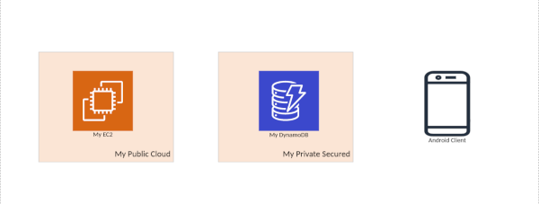
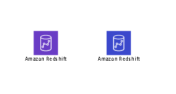

---

??? note "This mapping configuration only applies to Visio and Lucidchart Processor."
    
    Please refer to another mapping file configuration documentation if needed. 
    You can locate each processor's documentation in the left menu under the "StartLeft Processors (SLP)" section. 

The greatest challenge when mapping Microsoft Visio files is that it is a completely open format where the user can
place whatever they want. For that reason, the `slp_visio` works with some premises in order to build an OTM file
with only the necessary information:

* There are different ways of parsing TrustZones, but only the default TrustZone will be generated if no Trustzone 
appears in any of the mapping files.
* The only shapes that will be parsed into the OTM components are the ones whose name or type matches some label in the 
  mapping file. The rest of them will be ignored.
* There is no need to create mappings for the DataFlows, they will be generated from those Visio connectors that 
  link components that have also been mapped into the OTM.
* Nested shapes are automatically processed and parsed to the OTM components and TrustZones. There is no need to 
  define parent relationships in the mapping files.

## Mapping hierarchy

---
The StartLeft's Visio SLP support two types of mapping files. They both have exactly the same structure and behavior,
but are intended to be used for different types of mappings. 

### Default mapping file
As stated in the [Visio Quickstart](Visio-Quickstart.md), stencils are a powerful Visio feature. From the point of 
view of StartLeft, those users that use them in their diagrams may reduce a lot the work they have to do in order to 
build their mappings. This is because the mappings for the stencils can be reused across every request to StartLeft 
and does not need to be created each time.

Other potential case or mappings reuse are the generic TrustZones. Even if you may have some diagrams with specific 
TrustZones, it is a common case to have a fistful of them that tend to be present in most of your diagrams. 
Thus, you should not need to map them again and again. In conclusion, for all those elements that you do not want to 
map in each request because are common and reusable, you can build a default mapping file. Indeed, if you are 
going to use StartLeft in a script or pipeline, you can simply save the default mapping file and inject it in 
every StartLeft request. That is, for example, how IriusRisk's import processes work.

### Custom mapping file
This file is used to cover the rest of elements that are not generic, but specific to a concrete diagram. 
Remember that only the shapes whose type or name are in the mapping file will be parsed into the OTM so, everything 
you need to be processed in a Visio file should be in the default or in the custom mapping file. <u>In case the same 
mapping appears in both mapping files, the one in the custom file takes preference</u>.


## Mapping file structure

---
The Visio mapping file is expected to be a YAML file whose structure is exactly defined by its
[json schema](https://github.com/iriusrisk/startleft/blob/main/slp_visio/resources/schemas/diagram_mapping_schema.json). 
It is divided in three great blocks described in depth below. So, the root structure of the file is composed by three 
arrays for the mappings of each type of element:

```yaml
trustzones: []
components: []
configuration: {}
```

Each of these arrays contains the information for mapping shapes into TrustZones, Components, or configure 
particular behavior for the processor.  
Also note that all three are mandatory and have to be included in each mapping file, even if they only contain an empty array.

### Mapping TrustZones 
The [OTM standard](../../../Open-Threat-Model-(OTM).md) defines that every component in the threat model must have a 
parent, so you must make sure that the mapping file contains a mapping entry for all the TrustZones present in the 
diagram as well as a default one so, if no parent can be calculated for a component, it can fall into this default 
TrustZone.
```yaml
trustzones:
  - label:    My Public Cloud
    type:     b61d6911-338d-46a8-9f39-8dcd24abfe91
```
When a shape is found in the Visio file whose **name** matches the mapping's **label**, then a TrustZone is created
with these OTM Trustzone fields:
  - **id** is the original id in the Visio file 
  - **name** is the original name in the Visio file 
  - **type** is the type in the mapping file 


For example, for this TrustZone in the Visio file and the previous mapping:


The resultant OTM would contain a TrustZone like this:
```json
{
  "trustZones": [
    {
      "id": "47",
      "name": "My Public Cloud",
      "type": "b61d6911-338d-46a8-9f39-8dcd24abfe91",
      "risk": {
        "trustRating": 10
      }
    }
  ]
}
```


#### Default Trustzone
The components in the Visio file that there aren't inside a trust zone will be assigned to the default trust zone.
We can define the default trust zone in the mapping file by this way:
```yaml
trustzones:
  - label:    My Public Cloud
    type:     b61d6911-338d-46a8-9f39-8dcd24abfe91

  - label:    My Private Secured
    type:     2ab4effa-40b7-4cd2-ba81-8247d29a6f2d

  - label:    Internet
    type:     f0ba7722-39b6-4c81-8290-a30a248bb8d9
    default:  true
```
Let's see an example



In this example "My EC2" will have "My Public Cloud" as parent, "My DynamoDB" will have "My Private Secured" as parent,
and the "Android Client" will have the "Internet" parent defined in the mapping file as default trust zone.
So the OTM would be like this:

```yaml
{
    "trustZones": [
        {
            "id": "47",
            "name": "My Public Cloud",
            "type": "b61d6911-338d-46a8-9f39-8dcd24abfe91",
            "risk": {
                "trustRating": 10
            }
        },
        {
            "id": "48",
            "name": "My Private Secured",
            "type": "2ab4effa-40b7-4cd2-ba81-8247d29a6f2d",
            "risk": {
                "trustRating": 10
            }
        },
        {
            "id": "39388080-e23b-4e16-976a-27f2f086dc0e",
            "name": "Internet",
            "type": "f0ba7722-39b6-4c81-8290-a30a248bb8d9",
            "risk": {
                "trustRating": 10
            },
            "properties": {
                "default": true
            }
        }
    ],
    "components": [
        {
            "id": "54",
            "name": "My EC2",
            "type": "ec2",
            "parent": {
                "trustZone": "47"
            }
        },
        {
            "id": "59",
            "name": "My DynamoDB",
            "type": "dynamodb",
            "parent": {
                "trustZone": "48"
            }
        },
        {
            "id": "66",
            "name": "Android Client",
            "type": "android-client",
            "parent": {
                "trustZone": "39388080-e23b-4e16-976a-27f2f086dc0e"
            }
        }
    ],
    "dataflows": []
}
```
Note that the Internet id is autogenerated unlike the other trust zones present in the Visio file, which id comes from
the id in the Visio file


>Due to a backward compatibility StartLeft accepts as well the legacy mapping file format.
>Please read [Legacy-Mapping-File-Format](../legacy/Legacy-Mapping-File-Format.md)


#### Default TrustZone not defined
Since it must necessarily have one trust zone, if any trust zone is defined as default in the mapping file
<u>the _Public Cloud_ will always be the default one</u>.

---

These are the basics for the TrustZone mapping behavior, but TrustZones may be defined in different and more complex
ways that are explained in deep in the
[TrustZones mapping's page](Visio-TrustZones-Mapping.md).
### Mapping Components
Components mappings' structure is similar to the TrustZones. For example, we can have a mapping like this:
```yaml
components:
  - label:  Shape's name
    type:   OTM's type
```
However, its behavior presents the particularity that the label may refer to the _type_ or the _name_ of the shape. 
For instance, suppose we have this diagram:


Considering that the *My EC2* shape belongs to the AWS stencils, the more logical scenario is mapping it by **type** 
in the default mapping file. For that, you have to use its name in the stencil, that is the one you can see in Visio 
when you select the shape:


With this, you may compose a mapping like this:
```yaml
components:
  - label:  Amazon EC2
    type:   ec2
```

That will result in an OTM component like this:
```json
{
  // The ID is the unique id got from the Visio file
  "id": "1",
  "name": "My EC2",
  "type": "ec2",
  "parent": {
    // The parent is the default TrustZone
    "component": "b61d6911-338d-46a8-9f39-8dcd24abfe91"
  }
}
```

For the _My Custom Machine_ component, you need to map by name instead of type, so we can create a custom mapping 
file with this content:
```yaml
components:
  - label:  My Custom Machine
    type:   empty-component
```

The resulting OTM would be:
```json
{
  // The ID is the unique id got from the Visio file
  "id": "2",
  "name": "My Custom Machine",
  "type": "empty-component",
  "parent": {
    // The parent is the default TrustZone
    "component": "b61d6911-338d-46a8-9f39-8dcd24abfe91"
  }
}
```

It is important to notice that <u>mapping by name has priority over mapping by type</u>. So if you 
include mappings in both mapping files for the _My EC2_ component like this:
```yaml
// In the default mapping file
components:
  - label:  Amazon EC2
    type:   ec2

// In the custom mapping file
components:
  - label:  My EC2
    type:   empty-component
```

It would result in a OTM like this:
```json
{
  // The ID is the unique id got from the Visio file
  "id": "1",
  "name": "My EC2",
  "type": "empty-component",
  "parent": {
    // The parent is the default TrustZone
    "component": "b61d6911-338d-46a8-9f39-8dcd24abfe91"
  }
}
```

Finally, as seen in the following picture, there are certain stencils that, despite representing different components, 
share the same type. In this example, one is Amazon Redshift for AWS Analytics, and the other one for AWS Databases.



In case both stencils appear in the diagram, an internal identifier called **UniqueID** 
can optionally be used to differentiate them.

This way, they can be mapped to different components in the following manner:
```yaml
components:
  - label:  Amazon Redshift
    id:     0508F4C7-001F-0000-8E40-00608CF305B2
    type:   redshift

  - label:  Amazon Redshift
    id:     0509DF75-001B-0000-8E40-00608CF305B2
    type:   empty-component
```

!!! note
        Note that mapping by UniqueID has priority over both, mapping by name and mapping by type, but the label must 
        still be correct.

The resulting OTM will be as follows:
```json
{
  "components": [
    {
      "id": "1",
      "name": "Amazon Redshift",
      "type": "empty-component",
      "parent": {
        "trustZone": "b61d6911-338d-46a8-9f39-8dcd24abfe91"
      }
    },
    {
      "id": "13",
      "name": "Amazon Redshift",
      "type": "redshift",
      "parent": {
        "trustZone": "b61d6911-338d-46a8-9f39-8dcd24abfe91"
      }
    }
  ]
}
```

??? abstract "How to find the UniqueID of a stencil"
    Being **UniqueID** an internal property, finding the value for a specific component is not straightforward.
    
    The easiest way is creating a diagram with only the desired stencil, and extracting the contents of the .vsdx file
    with any file archiver that supports the ZIP format.
    
    From the root of the extracted files and folders, it is possible to navigate to the visio/masters subfolders and 
    open the masters.xml file, where the name of the stencil and its UniqueID appears.

    

    More info in the <a href="https://learn.microsoft.com/en-us/openspecs/sharepoint_protocols/ms-vsdx/e58f5f25-76d8-4f65-ae24-d286b10168d7" target="_blank">official Microsoft documentation</a>.

### Mapping DataFlows
The DataFlows mapping process is fixed and not configurable. Basically, it takes all the arrows in the Visio source that connect 
components that are mapped and create a DataFlow for them. If some arrow connects shapes that are not mapped, the 
DataFlow is not created. This can be easily understood with the following picture:


## Mapping Functions
This processor includes multiple functionalities to map Component and TrustZones. 
These functionalities aim to give flexibility when mapping shapes and to avoid the need to create numerous mapping entries.
All these functionalities are available to map both, components and TrustZones.

### Mapping by Label

```yaml
  - label: AmazonS3
    type: s3
```

!!! note ""

    This configuration sets all the shapes with name/type `AmazonS3` to components of type `s3`

### Mapping by a list of Labels

```yaml
  - label: [AmazonS3, AmazonSimpleStorageServiceS3]
    type: s3
```

!!! note ""

    This configuration sets all the shapes of name/type `AmazonS3` or `AmazonSimpleStorageServiceS3` to components of type `s3`

### Mapping by a Regex

```yaml
  - label: {$regex: ^AWS Region:.*$}
    type: Public Cloud
    id: b61d6911-338d-46a8-9f39-8dcd24abfe91
```

!!! note ""

    This configuration maps all the shapes whose name/type matches the regex `^AWS Region:.*$` to TrustZones of type `Public Cloud`

