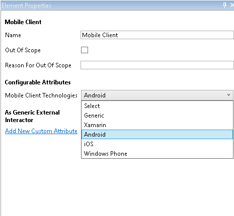

# MTMT mapping

---

A source mapping file (or 'mapping file' for short) describe how to identify components, dataflows, TrustZones, 
threats and mitigations in source file and how to map them to the OTM equivalent.

Let's see howto identify the different elements:


## Trustzones
For the TrustZones we need to write two fields: ``label`` and ``id``

The label will identify the MTMT TrustZone by its type. 

Let's see an example with a TrustZone in the MTMT_example.tm7:


Our TrustZone named ``Internet`` is of ``Generic Trust Border Boundary`` type.


So we need to put this
type in the label value.

The id in the mapping file will be the id in the OTM TrustZone output:

```yaml
  - label: Generic Trust Border Boundary
    id: 6376d53e-6461-412b-8e04-7b3fe2b397de
```

The TrustZone OTM output will be:
```json
  {"trustZones": [
    {
      "id": "6376d53e-6461-412b-8e04-7b3fe2b397de",
      "name": "Internet",
      "risk": {
        "trustRating": 10
      },
      "properties": {
        "Name": "Internet"
      }
    }]}
```


## Components
For the components we need to write two fields: ``label`` and ``type``.

The label will identify the MTMT component by its MTMT type. Let's see again the MTMT_example.tm7:


Our ``Public API v2`` component is of ``Web API`` type.


So we need to put this type in the label value.

The ``type`` in the mapping file will be the type in the OTM component output.

```yaml
  - label: Web API
    type: web-service
```

The component OTM output will be:
```json
  {"components": [
    {
      "id": "5d15323e-3729-4694-87b1-181c90af5045",
      "name": "Public API v2",
      "type": "web-service",
      "parent": {
        "trustZone": "b61d6911-338d-46a8-9f39-8dcd24abfe91"
      },
      "properties": {
        "Name": "Public API v2"
      }
    }]}
```
As you can see, the OTM component name is coming from the custom name in the MTMT, in our case ``Public API v2``.

### Mobile Client Component
The ``Mobile Client`` component is a special case that needs a little customization in the mapping file.



Because from the threat modeling point of view is not the same an Android than a iOS, we need
to know which type of component is based in its ``Mobile Client Tecnologies`` property configured in
the mapping file. Let's see how to do it:
```yaml
  - label: Mobile Client
    key: Mobile Client Technologies
    values:
      - value: Android
        type: android-device-client
      - value: iOS
        type: ios-device-client
```
- The ``label`` is the component type
- The ``key`` is the property of the component where we are going to extract the value
- The ``values`` is a map to convert from the MTMT ``value`` of the property to the OTM ``type``


## Dataflows
No need to be in the mapping file. StartLeft will detect them and will fill the OTM dataflow automatically detecting
the custom name, the source, and the destination.
## Threats
No need to be in the mapping file. StartLeft will detect them and will fill the OTM threats automatically.
## Mitigations
No need to be in the mapping file. StartLeft will detect them and will fill the OTM mitigations automatically.